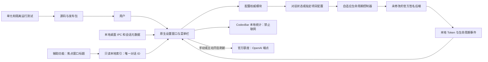

# Codex 上下文

一个原生 macOS 伴随工具：不用在聊天里发送配置指令，即可为 Codex 对话或项目选择上下文策略，并查看 Token 用量与账户额度。

[下载试用版](https://github.com/yimengbenxin/codex-context-menu/releases/tag/v0.6.5) · [反馈问题](https://github.com/yimengbenxin/codex-context-menu/issues) · [English](README.en.md)

**非 OpenAI 官方产品，未获 OpenAI 背书。0.6.5 是兼容范围有限的实验性试用版，不是适用于所有 Codex 安装的通用补丁。**

## 为什么做这个工具

长任务需要调整上下文，但不应该为此向项目聊天反复发送“修改上下文”的指令。同一项目有多个对话时，仅选择文件夹也不够准确。

本工具把“目标对话”“保存的设置”和“实际运行窗口”分开呈现；通过对话深度链接精确定位，在两轮对话之间加载设置，不打断正在生成的回复。

## 已发布功能

| 功能 | 说明 |
| --- | --- |
| 官方默认 | 清除所选范围的覆盖，继承上级配置及官方参数；不写死 272K 或模型 |
| 自定义 | 输入整数 K；1 K = 1,000 tokens；留空清除覆盖 |
| 自适应 | 可修改两次 / 一次触发阈值和三个档位；留空档位跟随官方元数据 |
| 对话级 / 项目级 | 默认可选“仅此对话”；项目级需明确选择，不把对话覆盖复制给其他对话或新分叉 |
| 识别当前对话 | 优先读取 Codex 焦点窗口的对话标题，精确匹配唯一 ID；不按后台输出或最近订阅猜测 |
| 深度链接 | 支持粘贴 `codex://threads/<UUID>` 并定位；提供原生 ⌘V、⌘A 等编辑操作 |
| 下一轮加载 | 接入后，默认、自定义切换及自适应升档无需逐次重启 Codex |
| 用量概览 | 查看本地近七天 Token 统计，手动读取官方账户额度；自动额度刷新默认关闭 |
| 安装与恢复 | 支持拖入应用后在窗口内完成接入；协议检查、旧安装备份、失败回滚及启动环境恢复 |

**不包含换模型压缩、调整压缩推理强度或压缩加速插件。** 模型请求和压缩仍由官方后端执行。

## 安装要求与兼容范围

当前安装包仅支持：

- **macOS 14 或更新版本、Apple Silicon。**
- **Python 3.11+**：现有 Codex 管理的 Python，或 `/opt/homebrew/bin/python3`、`/usr/local/bin/python3`。
- 已验收官方 CLI **0.159.0 和 0.159.2**；其他版本按实际协议能力检查，不以版本号或发布机哈希直接拒绝。
- 使用带 OpenAI 身份签名的官方 CLI 与 Node。支持 `/Applications` 或用户 Applications 下的 `Codex.app` / `ChatGPT.app`，其中一种已验收布局如下：

```text
/Applications/ChatGPT.app/Contents/Resources/codex-cli/CodexCLI.app/Contents/MacOS/codex
/Applications/ChatGPT.app/Contents/Resources/cua_node/bin/node
```

其他版本只有在签名与所需会话恢复、取消订阅、配置读取和窗口反馈接口通过检查后才允许接入；这不代表所有版本都完成了长期验收。不同官方布局若未发现成对的 CLI / Node，会给出具体错误。Intel Mac、Windows 和 Linux 暂不支持。检查不通过不进行安装或持久配置变更。工具不会下载、修改或重新签名 OpenAI 程序。普通使用无需另装 Python 库。

### 下载与安装

到 [0.6.5 发布页](https://github.com/yimengbenxin/codex-context-menu/releases/tag/v0.6.5) 下载：

- `CodexContextMenu-0.6.5-macOS-arm64.dmg`：磁盘映像。
- `CodexContextMenu-0.6.5-macOS-arm64.zip`：压缩包，与 DMG 包含相同应用和安装程序。
- `v0.6.5-SHA256.txt`：文件校验值。

1. 校验下载文件，解压 ZIP 或挂载 DMG。
2. 将 `CodexContextMenu.app` 拖入 DMG 中的 Applications 入口，再从应用目录打开。挂载 DMG 本身并不等于安装。
3. 首次只复制应用时，窗口会显示 **“完成组件接入 / 重新验证”**。点击完成协议检查与运行组件接入，建立本工具的用户级启动项。重启不能代替这一步。也可保持应用和安装脚本在同一目录，双击 `Install.command`，由它备份旧安装并安装到 `~/Applications`。不需要管理员密码。
4. **整个 Codex 首次启用本工具的启动接入时，完整退出并重新打开一次。不是每个对话首次使用都要重启。** 更新运行组件也需要重新加载新组件；普通预算切换不需要重启。
5. 打开“Codex 上下文”，识别或定位目标，选择范围和策略，保存后在下一轮检查“最近运行窗口”。

应用为本地临时签名，**未使用 Apple Developer ID 签名及公证**。核对来源和校验值后，按系统提示手动批准运行。安装程序不关闭 Gatekeeper、不静默移除隔离标记，也不绕过系统警告。

只读安装前检查：

```sh
python3 install_local.py ./CodexContextMenu.app --check
```

签名检查使用临时副本，仅移除 Finder 装饰及资源分支元数据，保留隔离标记；不会修改下载的应用或持久安装状态。

## 使用方式与自适应逻辑

### 精确选择目标

点击“识别当前对话”，或者将对话深度链接粘贴到输入框，再点击“定位链接”。核对目标和修改范围：

0.6.5 修复多个对话同时运行时无法识别的问题。先点选目标 Codex 窗口，再打开本工具；系统保留的最近 Codex 焦点窗口也可用于定位。工具只读取该窗口应用 WebArea 的标题，使用本地索引的有效显示名称精确查找唯一对话 ID，再核对原始会话元数据，不读取聊天正文来猜目标。界面显示对话标题和“定位来源：窗口焦点”。

焦点定位需要系统“隐私与安全性 → 辅助功能”权限。首次缺少权限时会提示授权；不自动替用户批准。未授权时仍可使用深度链接，但不会把后台订阅当作焦点。系统辅助功能权限本身范围较宽；本工具的实现只读取窗口标题，不发送 Codex UI 控制动作。存在同名对话、非对话页、定位期间窗口或标题变化时，不按最近活动选一个，而是提示重试或粘贴深度链接。

- **仅此对话**：只保存该对话的设置。
- **项目级**：明确修改所选项目的配置，可能影响继承项目设置的其他对话。

保存成功只表示设置已写入，**不代表运行时已经加载**。下一轮以实际运行反馈为准。正在生成、存在其他订阅者或无法完整保留的权限状态时，可能无法立即重新加载。

### 自适应如何升档

三个档位来自官方模型元数据：**官方初始值 → 初始值与上限的算术中间值 → 官方上限**，不是固定的 272K / 487K / 872K。

自动压缩成功后，依据保留比例判断：

- 默认保留比例 **≥65%**：升一档。
- 默认 **≥45% 且 <65%**：连续两次满足条件后升一档。
- 低于两次触发线：重置连续计数。
- 可将阈值改为例如 **30 / 50**；三个档位分别输入整数 K，留空使用对应官方值。档位须有序，并受官方模型上限约束。
- 初始与上限留空取官方值；中间档留空时，取当前初始与上限的算术中点，包含你自定义的端点。
- 手动压缩或失败压缩：不升档。

满足条件后，新档位在**下一轮对话**加载，不改变本轮正在生成的回复，也不必再等一次压缩。

从自定义切回自适应：**从配置的初始档重新开始**；初始档留空时使用官方初始值。不保留旧的自定义预算或历史升档。保存操作更新激活代次，状态修订随之变化；保持自适应时正常重启仍恢复同一代次的档位。

### 数值与缓存

输入 485 表示原始预算 485,000 tokens，但实际窗口受到官方有效窗口比例和模型上限约束，不一定显示为 485,000。默认模式不固定任何数值。

会话重载可能暂时降低缓存命中率，**不能承诺零缓存成本**。已观察到切换后命中率短暂下降、后续请求恢复较高复用，但这不是严格控制变量的因果测试。

## 架构与工作流程



控制器复用官方会话读取和恢复机制，由原生后端重建空闲会话缓存；不会另写一套模型执行器。上下文策略不改模型或推理强度。

## 隐私、权限与网络

- 上下文控制器未添加遥测、远程控制监听、凭据共享或聊天上传功能。
- 为识别对话和显示用量，需要读取本地会话元数据与日志；焦点识别只读窗口标题及 SQLite 中的 ID / 名称，不遍历聊天正文。**不编辑聊天历史、SQLite、官方模型缓存或官方应用文件**。
- 对话设置写入 `$CODEX_HOME/context-menu/threads`；项目级明确写入所选 `.codex/config.toml`，带版本检查和备份；不修改全局 TOML。
- 有界的 `runtime-events.jsonl` 只记录白名单生命周期元数据，不记录消息内容、工具结果或凭据。
- 启动接入修改四个用户级启动环境变量，并保存原值以便恢复；不修改官方应用包。
- **本地 Token 统计禁止联网。账户额度查询不是离线操作**：固定版本 CodexBar 使用已有认证访问官方 OpenAI 端点，可能进行正常 OAuth 刷新；没有浏览器 Cookie 回退，自动额度刷新默认关闭。
- 正常 Codex 请求保留官方自身的网络行为。本工具不是离线 Codex，也不能提供“整个系统绝无风险”的保证。
- 发布包不包含本机私人日志、聊天记录、登录凭据或官方运行程序。

## 验证结果与已知限制

0.6.5 的单元检查包含 **80 项**：33 项 Swift、24 项 Node、11 项项目配置、3 项对话配置、3 项安装器、3 项自适应参数及 3 项协议检查。另有 0.159.0 / 0.159.2 隔离原生生命周期、签名与安装前检查及发布资产校验。

已验证：

- 隔离合成响应环境中的默认 / 自定义 / 自适应、恢复、重启及分叉，历史前缀保留和 SQLite 完整性。
- 本机桌面 485K → 315K → 485K 切换，官方进程不重启；有效窗口随下一轮变化。
- 实际官方桌面工具调用，以及真实剪贴板粘贴和链接定位；不是用直接设置输入框值替代粘贴测试。
- 焦点标题唯一匹配、重名拒绝、改名、归档、SQL 字符、数据库只读、窗口 / 进程 / 标题变化；本机诊断确认焦点对话可以不同于后台订阅。实际伴随应用的焦点权限需用户授权，未授权时明确阻止自动识别。
- 两个官方 CLI 版本的隔离测试验证 30 / 50 阈值、320K / 550K / 800K 档位、下一轮升档、自定义切回初始档、重启保持新代次及数据库完整性。
- 全新用户目录与只复制应用后的组件接入、失败回滚已通过文件系统夹具；这不等同于一台真实全新 Mac 的完整验收。

**尚未证明**：真实超长对话自适应升档的完整桌面验收、所有插件兼容性及长期稳定性。合成生命周期测试不是模型压缩速度或质量评测。

当前为菜单栏伴随应用，**Dock 常驻及完整缩小/关闭体验、菜单栏直接选择三种策略、双击图标拉到前台**属于后续迭代，不包含在本次发布中。

## 开发与打包

需要 Xcode 命令行工具和 Swift 5.10+；测试还需要 Node 与 Python 3.11+。

```sh
swift test --package-path macos
node --test macos/Tests/adaptive.test.mjs macos/Tests/privacy-boundary.test.mjs
python3 -B -m unittest discover -s macos/Tests -p test_context_config.py
python3 -B -m unittest discover -s macos/Tests -p test_thread_settings.py
python3 -B -m unittest discover -s macos/Tests -p test_installer.py
python3 -B -m unittest discover -s macos/Tests -p test_adaptive_settings.py
python3 -B -m unittest discover -s macos/Tests -p test_runtime_probe.py
bash scripts/build_release.sh 0.6.5
```

可选原生夹具：在隔离环境安装 `requirements-test.txt`，具备受支持的官方程序和模型元数据后，运行 `python3 -B macos/Tests/test_adaptive_boundary.py`。它使用本地回环上的合成响应，不代表真实模型的质量和速度。

GitHub 源码归档包含维护源码及依赖许可，不包含私人验收日志。ZIP / DMG 不捆绑 Python 或官方 Codex 运行时。

## 卸载与恢复

可先切回默认以清除所选覆盖，再恢复官方启动环境：

```sh
"$HOME/Library/Application Support/CodexContextTool/backend" --restore-official
launchctl bootout "gui/$(id -u)/local.wen.CodexContextMenu"
```

将伴随应用和 `~/Library/LaunchAgents/local.wen.CodexContextMenu.plist` 移到废纸篓，确认恢复正常后再处理备份。卸载不会自动删除聊天历史、项目备份或已保存的覆盖设置。

## 许可证与反馈

采用 MIT，保留上游 [Codex Token Overlay](https://github.com/soleillevant0125/codex-token-overlay) 的许可与署名。依赖 CodexBar 0.69.0 和 tomlkit 0.13.3 同为 MIT，见 [第三方声明](docs/THIRD_PARTY_NOTICES.md)。不分发 OpenAI 软件。

反馈时请提供平台、应用版本及脱敏的问题描述，**不要上传凭据、SQLite 数据库或真实聊天日志**。
