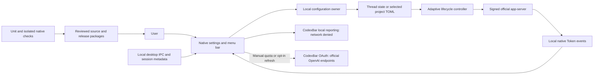

# Codex Context Menu

A native macOS companion for choosing a Codex conversation's context budget without sending configuration instructions into chat.

[简体中文](README.zh-CN.md) · [Downloads](https://github.com/yimengbenxin/codex-context-menu/releases) · [Issues](https://github.com/yimengbenxin/codex-context-menu/issues)

**Unofficial community software. Not developed, endorsed or supported by OpenAI.** Version 0.6.4 is an experimental, narrowly compatible release, not a universal Codex patch.

## Why / problems solved

Long tasks need explicit context-budget control without polluting project conversations. Folder selection alone is ambiguous when several chats share a project. This companion separates the selected chat, saved settings and observed running window, and applies changes at the next idle turn instead of interrupting a response.

## Features

- Native settings window with official-default, adaptive and custom integer-K modes. Blank custom input clears the selected override.
- Identify a unique local desktop conversation, or paste `codex://threads/<UUID>` with standard macOS Command+V editing. Ambiguous multi-window selection requires a deep link.
- Thread-only overrides, or explicitly selected project-wide settings. Thread overrides do not affect sibling conversations or new forks.
- Adaptive tiers derive from official model metadata: initial, arithmetic midpoint, maximum. Automatic successful compaction can advance a tier; failed/manual compaction cannot. A prior matching adaptive state is restored when returning to adaptive; a custom value does not become an adaptive tier.
- Default/custom changes load at the next idle turn using the **unmodified signed official CLI**. No compression-model or reasoning-effort optimization is bundled.
- Local seven-day Token reporting and manually requested official account quota via pinned CodexBar CLI. Automatic quota refresh is off by default.

## Installation / requirements

This release supports **macOS 14+, Apple Silicon, Python 3.11+**, and the tested official **0.159.2** CLI/Node pair in this layout:

```text
/Applications/ChatGPT.app/Contents/Resources/codex-cli/CodexCLI.app/Contents/MacOS/codex
/Applications/ChatGPT.app/Contents/Resources/cua_node/bin/node
```

Both official executable hashes must match [compatibility.json](macos/Resources/adaptive/compatibility.json). **A differently laid-out Codex.app, Intel Mac, Windows, Linux or another official binary version is not supported by this first package.** Preflight refuses an unsupported runtime before copying or changing anything. The app does not download, modify or resign OpenAI executables.

Use the existing Codex-managed Python runtime, or Python 3.11+ at `/opt/homebrew/bin/python3` or `/usr/local/bin/python3`. No Python libraries need installing for normal use; the TOML editor is vendored with its license.

1. Download `CodexContextMenu-0.6.4-macOS-arm64.zip` or the equivalent DMG from Releases. Verify against `v0.6.4-SHA256.txt`.
2. Extract the ZIP (or mount the DMG). Keep `Install.command`, `install_local.py` and `CodexContextMenu.app` together.
3. Double-click `Install.command`. It checks compatibility, backs up an existing installation, installs to `~/Applications`, creates its own login LaunchAgent, and enables the startup integration. No administrator password is needed.
4. Fully quit and reopen Codex **once for initial integration**. This is not a per-conversation restart. Installing an updated runtime component also requires loading that new component; ordinary budget changes do not.
5. Open the companion, identify or paste a local chat link, keep **仅此对话** for a private override, choose a mode and save. Start the next turn and check **最近运行窗口**.

The bundle is ad-hoc signed, **not Developer ID notarized**. macOS may require manual trust approval under Privacy & Security after you verify the download. The installer does not disable Gatekeeper, silently remove quarantine, or bypass system warnings.

Signature preflight checks a temporary copy without Finder decoration/resource-fork metadata; quarantine is preserved. It does not modify the downloaded bundle or persistent installation during `--check`.

Read-only preflight:

```sh
python3 install_local.py ./CodexContextMenu.app --check
```

## Usage and boundaries

One K means 1,000 tokens. The actual window can be reduced by the official effective-window percentage and model maximum; 485K need not display as 485,000. Default never hardcodes a number or model.

Setting changes apply **between turns**, not during generation. Native resume owns idle-cache reconstruction; active, externally subscribed or unrepresentable permission states can prevent a reload. A successful save is not proof of activation: observe the running window. Reloading can temporarily reduce cache reuse; zero cache cost is not promised.

The current app is a menu-bar accessory, not a Dock-first app. A Dock-focused window lifecycle, quick mode selection in the menu bar and double-click activation are **future work**, not shipped 0.6.4 features. Real long-history adaptive promotion has not received full desktop acceptance; synthetic lifecycle tests are not a quality benchmark.

## Architecture / how it works



## Privacy / data and network

- No telemetry, remote control listener, credential sharing or chat upload feature is added by the context controller.
- Local session logs are read to identify conversations and display usage; chat history, SQLite, official model caches and the official application are not edited.
- Thread settings live under `$CODEX_HOME/context-menu/threads`. Project-wide settings explicitly update the selected `.codex/config.toml`, with revision checks and backups. Global TOML is not changed.
- A bounded local `runtime-events.jsonl` journal records only whitelisted lifecycle metadata, not messages, tool results or credentials.
- Startup integration changes four per-user launch environment variables and stores their prior values for restoration. It does not alter the official app bundle.
- Local cost reporting runs with networking denied. **Quota reads are different:** CodexBar uses existing authentication against official OpenAI endpoints and may perform normal OAuth refresh. There is no browser-cookie fallback. Automatic quota reads default off; turn them off in the Usage tab.
- Ordinary Codex requests retain their existing official network behavior. This package is not an offline replacement for Codex. No private runtime data or test logs are shipped.

## Verification / development

Build requires Xcode command-line tools with Swift 5.10+; development tests also use Node and Python 3.11+.

```sh
swift test --package-path macos
node --test macos/Tests/adaptive.test.mjs macos/Tests/privacy-boundary.test.mjs
python3 -B -m unittest discover -s macos/Tests -p test_context_config.py
python3 -B -m unittest discover -s macos/Tests -p test_thread_settings.py
python3 -B -m unittest discover -s macos/Tests -p test_installer.py
bash scripts/build_release.sh 0.6.4
```

The 0.6.4 snapshot passed 22 Swift, 23 Node, 11 project-configuration and 3 thread-configuration checks. Installer filesystem/rollback fixtures and package integrity are checked separately. Native synthetic-response tests cover default/custom/adaptive, recovery, restart/fork, preserved history prefixes and SQLite integrity. Live desktop checks verified 485K → 315K → 485K effective windows without restarting the official processes, plus a genuine desktop tool call. Native clipboard paste and link resolution were exercised, not replaced by direct field assignment.

To run the optional native fixture, install `requirements-test.txt` into an isolated environment and run `python3 -B macos/Tests/test_adaptive_boundary.py` with the supported official app and model metadata available. It uses synthetic responses on loopback; it is not a real-model speed or quality test.

## Release variants / uninstall

ZIP and DMG contain the **same app and installer**, with no Python/official Codex runtime bundled. GitHub source archives contain the maintained native source and dependency notices, not local acceptance logs.

Before removal, use default mode to clear selected overrides if desired, then restore startup integration:

```sh
"$HOME/Library/Application Support/CodexContextTool/backend" --restore-official
launchctl bootout "gui/$(id -u)/local.wen.CodexContextMenu"
```

Move the companion app and `~/Library/LaunchAgents/local.wen.CodexContextMenu.plist` to Trash. Keep backups until satisfied. Uninstalling does not delete chat history, project backups or previously saved overrides automatically.

## License / help

MIT, retaining the upstream [Codex Token Overlay](https://github.com/soleillevant0125/codex-token-overlay) license and attribution. CodexBar 0.69.0 and tomlkit 0.13.3 are MIT dependencies; see [third-party notices](docs/THIRD_PARTY_NOTICES.md). OpenAI software is not redistributed.

Report issues with platform/app versions and a redacted symptom description. Do not attach credentials, SQLite databases or real chat logs.
